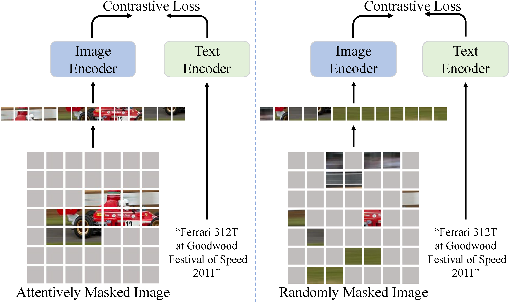
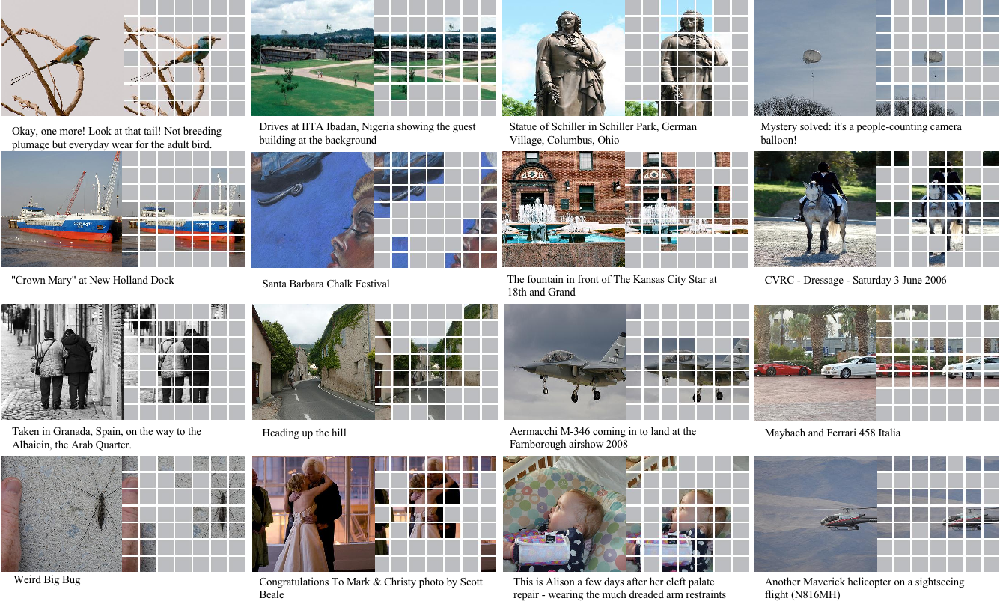

# A-CLIP


## Introduction
This is the official implementation of Attentive Mask CLIP ([A-CLIP](https://arxiv.org/abs/2212.08653v2)). A-CLIP aims to improve the efficiency of CLIP training by introducing an efficient image augmentation approach called image token removal.  
  
The purpose of this paper is to improve the training efficiency of CLIP by using the image token removal strategy. This method has been proven effective in tasks such as mask image modeling. However, random masking in CLIP may lead to semantic mismatch issues that could affect performance. To address this concern, we propose an attentive masking strategy that retains the most relevant areas to the text while removing tokens.  

  

For example, in the case of a Ferrari image in the top-left corner, it would be difficult to identify and correctly align with the text under random masking. However, with our attentive selection, we only eliminate irrelevant areas while maximizing the preservation of semantics to avoid ambiguity.  


| Mask Strategy (View × Ratio) | IN 1K 0-shot | Flickr30K I2T | Flickr30K T2I | MS COCO I2T | MS COCO T2I |  
|------------------------------|--------------|---------------|---------------|-------------|-------------|  
| w/o mask                     |              |               |               |             |             |  
| 1×100%                       | 37.6         | 51.4          | 32.6          | 27.9        | 17.6        |  
| +random mask                 |              |               |               |             |             |  
| 1×50%                        | 35.0         | 48.8          | 32.5          | 28.9        | 16.6        |  
| 2×50%                        | 38.0         | 54.6          | 34.4          | 31.1        | 18.7        |  
| +attentive mask              |              |               |               |             |             |  
| 1×50%                        | 39.5         | 57.6          | 36.6          | 34.2        | 19.8        |  
| 2×50% (highlighted)          | **41.3**     | **59.3**      | **38.4**      | **35.1**    | **21.3**    |  

Experiments show that attentive masking can avoid the semantic mismatch problems caused by random mask and bring the following benefits:
1. **Training efficiency**: Eliminates redundant tokens and improves CLIP's training efficiency.  
2. **Feature stability**: Retains semantically relevant areas, enhances feature stability, and alleviates ambiguity caused by semantic mismatch.  By using this approach, our A-CLIP significantly improves both the training efficiency and performance of CLIP.

We compare our attentive mask CLIP (A-CLIP) with CLIP, SLIP, and MaskCLIP. A-CLIP outperforms CLIP by +6.3%, +11.3/+9.5 and +10.1/+5.6 on Imagenet-1K zero-shot classification, Flickr30K and MS COCO I2T/T2I retrieval. An efficient variant termed A-CLIP-eff outperforms CLIP by +5.3%, +11.3/+8.0, and +9.5/+4.9 on these benchmarks, while reducing the training time to 0.86x.

| Methods | Training Time | GPU Memory | IN 1K 0-shot | Flickr30K I2T/T2I | MS COCO I2T/T2I |  
|---------|---------------|------------|--------------|------------------|-----------------|  
| CLIP    | 1.00×         | 14G        | 37.6         | 51.4/32.6        | 27.9/17.6       |  
| SLIP    | 2.67×         | 30G        | 42.8         | 57.2/41.2        | 33.6/21.9       |  
| MaskCLIP| 1.56×         | 16G        | 42.7         | 60.0/38.8        | 34.1/21.2       |  
| A-CLIP  | 1.16×         | 14G        | **43.9**     | **62.7/42.1**    | **38.0/23.2**   |  
| A-CLIP-eff | 0.86×      | 13G        | 42.9         | **62.7**/40.6    | 37.4/22.5       |  
  
> Note: The full training wall clock time and GPU memory footprint are measured on the same device. We report the training cost relative to the original CLIP.  
  
Zero-shot evaluation on a variety of classification benchmarks. The **Epochs** indicates the number of training rounds. A-CLIP significantly outperforms other methods at all epochs setting, both in terms of average accuracy and number of winning tracks of above 25 downstream tasks.

| Epochs | Methods  | Food-101 | CIFAR-10 | CIFAR-100 |  CUB  | SUN397 | Cars  | Aircraft |  DTD  | Pets  | Caltech-101 | Flowers | MNIST | FER-2013 | STL-10 | EuroSAT | RESISC45 | GTSRB | KITTI | Country211 | PCAM | UCF101 | Kinetics700 | CLEVR | HatefulMemes | SST2 | ImageNet | Average |  
|:------:|:--------:|:--------:|:--------:|:---------:|:-----:|:------:|:-----:|:--------:|:-----:|:-----:|:-----------:|:-------:|:-----:|:-------:|:------:|:-------:|:-------:|:-----:|:-----:|:---------:|:----:|:------:|:----------:|:-----:|:-----------:|:----:|:--:|:-------:|  
| 25  | CLIP     | 50\.6     | 66\.0     | 34\.5     | 38\.8     | 51\.1     | 4\.0      | 5\.4      | 21\.2     | 28\.5     | 60\.9     | 53\.3     | 8\.4      | 17\.3     | 90\.5     | 30\.2     | 21\.5     | 6\.1      | 35\.1     | 10\.5     | 53\.5     | 28\.5     | 22\.1     | 10\.8     | 52\.4     | 50\.7     | 37\.6     | 34\.2     |
|     | SLIP     | 59\.5     | 78\.6     | 45\.2     | 38\.7     | 53\.4     | **5\.4**  | 5\.7      | **26\.1** | 31\.1     | 71\.0     | 56\.6     | 9\.8      | 19\.6     | 94\.4     | 20\.3     | 28\.9     | **14\.5** | 34\.0     | 11\.6     | **55\.4** | 37\.7     | 26\.9     | **17\.5** | **52\.8** | **51\.1** | 42\.8     | 38\.0     |
|     | MaskCLIP | **60\.6** | 70\.1     | 41\.6     | **43\.3** | 54\.0     | 4\.9      | **8\.2**  | 25\.5     | **36\.8** | 68\.9     | 53\.6     | **11\.2** | 22\.4     | 93\.9     | **35\.1** | 24\.8     | 10\.1     | 30\.5     | 12\.5     | 51\.2     | 37\.0     | 28\.1     | 12\.9     | **52\.8** | 50\.0     | 42\.7     | 37\.8     |
|     | A-CLIP   | 58\.3     | **82\.8** | **51\.0** | 43\.0     | **57\.0** | **5\.4**  | 7\.6      | 26\.0     | 32\.0     | **71\.6** | **57\.7** | 9\.8      | **29\.7** | **95\.4** | 29\.3     | **30\.3** | 13\.1     | **35\.2** | **13\.5** | 51\.6     | **38\.3** | **29\.6** | 14\.1     | **52\.8** | 49\.9     | **43\.9** | **39\.6** |
| 50  | CLIP     | 55\.2     | 77\.0     | 43\.8     | 38\.9     | 49\.0     | 4\.7      | 6\.3      | 23\.5     | 27\.2     | 63\.5     | 56\.2     | **12\.5** | 30\.2     | 92\.1     | 21\.0     | 31\.9     | 7\.4      | 33\.6     | 10\.9     | 50\.8     | 35\.5     | 24\.8     | 14\.0     | 49\.9     | 50\.1     | 39\.4     | 36\.5     |
|     | SLIP     | 61\.9     | 76\.8     | 48\.9     | 39\.2     | 54\.8     | 7\.3      | 9\.0      | **29\.8** | 31\.9     | **75\.0** | 57\.7     | 9\.8      | 24\.9     | **95\.6** | 37\.8     | 32\.5     | 9\.0      | **35\.1** | 12\.7     | 54\.4     | 41\.1     | 30\.3     | 13\.8     | 49\.5     | 49\.9     | 44\.1     | 39\.7     |
|     | A-CLIP   | **62\.2** | **81\.5** | **53\.7** | **48\.2** | **58\.7** | **8\.3**  | **10\.2** | 27\.7     | **40\.5** | 73\.3     | **61\.0** | 11\.3     | **32\.9** | 95\.5     | **39\.7** | **37\.5** | **9\.4**  | 23\.3     | **14\.4** | **63\.7** | **42\.5** | **31\.6** | **19\.6** | **50\.8** | **52\.3** | **46\.3** | **42\.2** |
| 100 | CLIP     | 60\.4     | 79\.4     | 44\.6     | 43\.3     | 53\.0     | 8\.5      | 8\.2      | 26\.2     | 34\.7     | 68\.9     | 59\.2     | 11\.4     | 20\.4     | 93\.2     | 23\.3     | 27\.3     | 10\.3     | 23\.1     | 12\.0     | 54\.0     | 36\.7     | 27\.7     | 13\.0     | 50\.9     | 50\.1     | 42\.7     | 37\.8     |
|     | SLIP     | 63\.0     | 83\.1     | 50\.4     | 43\.0     | 52\.0     | 8\.3      | 8\.3      | 26\.2     | 34\.0     | 74\.6     | 61\.1     | **16\.1** | 32\.4     | 95\.1     | 22\.6     | 28\.5     | 10\.5     | **34\.8** | 11\.5     | 52\.1     | 37\.3     | 28\.3     | 13\.7     | **55\.2** | 49\.9     | 45\.0     | 39\.9     |
|     | A-CLIP   | **66\.7** | **86\.6** | **58\.6** | **51\.4** | **58\.6** | **10\.5** | **11\.9** | **33\.1** | **48\.5** | **74\.9** | **64\.3** | 7\.8      | **31\.2** | **96\.7** | **35\.6** | **35\.8** | **12\.9** | 30\.5     | **15\.7** | **57\.1** | **44\.1** | **33\.1** | **22\.9** | 52\.7     | **50\.7** | **48\.1** | **43\.8** |

The table shows the results of using longer training schedulers and a larger model size. 

| Methods  | IN 1K - 0-shot | Flickr30K - I2T | Flickr30K - T2I | MS COCO - I2T | MS COCO - T2I |  
|----------|----------------|----------------|----------------|---------------|---------------|  
| CLIP(25ep) | 37.6           | 51.4           | 32.6           | 27.9          | 17.6          |  
| SLIP(25ep) | 42.8           | 57.2           | 41.2           | 33.6          | 21.9          |  
| A-CLIP(25ep) | **43.9**       | **62.7**       | **42.1**       | **38.0**      | **23.2**      |
| CLIP(50ep) | 39.4           | 53.9           | 35.8           | 30.2          | 19.2          |  
| SLIP(50ep) | 44.1           | 60.6           | 41.1           | 33.2          | 22.3          |  
| A-CLIP(50ep) | **46.3**       | **66.7**       | **43.2**       | **39.8**      | **24.4**      |  
| CLIP(100ep) | 42.7           | 61.0           | 37.9           | 34.4          | 20.9          |  
| SLIP(100ep) | 45.0           | 59.3           | 41.4           | 34.6          | 22.7          |  
| A-CLIP(100ep) | **48.0**       | **66.3**       | **45.7**       | **40.7**      | **25.1**      |  
| CLIP(VIT-L) | 40.4           | 51.4           | 35.2           | 28.9          | 18.5          |  
| SLIP(VIT-L) | 46.2           | 60.6           | 43.7           | 35.3          | 23.5          |  
| A-CLIP(VIT-L) | **48.9**       | **64.1**       | **48.2**       | **39.1**      | **26.9**      |  


## Setup
Install [PyTorch](https://pytorch.org) and [timm](https://github.com/rwightman/pytorch-image-models). 
The code has been tested with CUDA 11.6, PyTorch 1.13.0 and timm 0.5.4.

### YFCC15M Setup
For data preparation, refer to [SLIP](https://github.com/facebookresearch/SLIP/tree/main).

## Pre-training
### A-CLIP ViT-Base with 8-nodes (batch size 4096)
```
python -m torch.distributed.launch --nproc_per_node=8 --nnodes=8 main.py \
  --root /path/to/yfcc100m --dataset yfcc15m --metadata /path/to/yfcc15m.pkl \
  --model ACLIP_VITB16 --batch-size 64 \
  --lr 5e-4 --wd 0.5
```

## Visualization
There are some cases to show Attentive mask magically preserve the content of text descriptions and filter out redundant backgrounds.

  

# Citation
If the code and paper help your research, please kindly cite:
```
@InProceedings{Yang_2023_ICCV, author = {Yang, Yifan and Huang, Weiquan and Wei, Yixuan and Peng, Houwen and Jiang, Xinyang and Jiang, Huiqiang and Wei, Fangyun and Wang, Yin and Hu, Han and Qiu, Lili and Yang, Yuqing}, title = {Attentive Mask CLIP}, booktitle = {Proceedings of the IEEE/CVF International Conference on Computer Vision (ICCV)}, month = {October}, year = {2023}, pages = {2771-2781} }
```